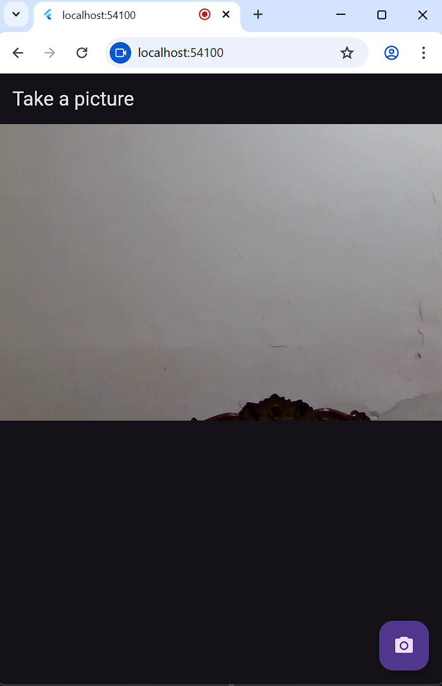
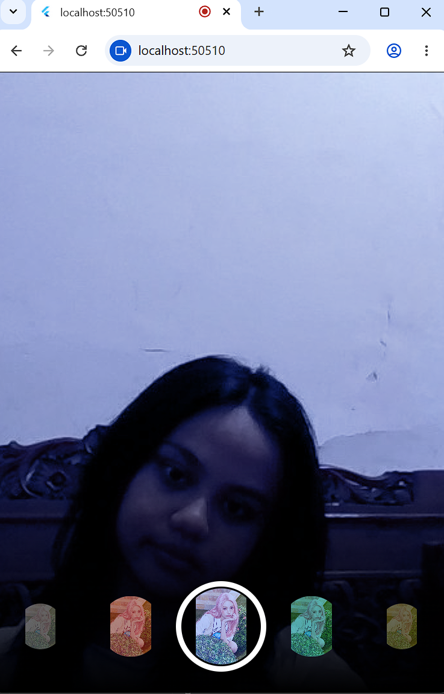

# TUGAS PRAKTIKUM

## 1. Dokumentasi Praktikum 1 dan 2

### Praktikum 1 — Kamera

<p align="center">
  
</p>

Pada praktikum 1 dibuat aplikasi kamera sederhana menggunakan package `camera`. Aplikasi menampilkan preview kamera secara realtime dan ketika tombol kamera ditekan, foto langsung diambil menggunakan `_controller.takePicture()`. Hasilnya berupa file foto yang tersimpan di memori perangkat.

---

### Praktikum 2 — Photo Filter Carousel

<p align="center">
  (https://github.com/aadinda75/pemrograman-mobile/blob/main/09Kamera/kamera_flutter/assets/praktikum2.mp4)
</p>

Pada praktikum 2 dibuat aplikasi filter foto dengan tampilan carousel di bagian bawah layar. Filter warna dibuat menggunakan `BlendMode.color` yang diterapkan ke gambar. Carousel filter dapat digeser ke kiri dan kanan, dan setiap filter yang dipilih langsung mengubah warna gambar secara realtime menggunakan `ValueNotifier` dan `ValueListenableBuilder` tanpa perlu menggunakan `setState()`.

---

## 2. Gabungan Praktikum 1 dan 2

<p align="center">
  
</p>

Setelah praktikum 1 dan 2 digabungkan di project `kamera_flutter`, seluruh file widget dari praktikum 2 yaitu `filter_carousel.dart`, `filter_selector.dart`, `filter_item.dart`, dan `carousel_flowdelegate.dart` disalin ke folder `lib/widget/` pada project kamera.

Selanjutnya, file `filter_carousel.dart` dimodifikasi agar tidak lagi menggunakan gambar statis dari asset atau internet, melainkan menerima parameter `imageBytes` berupa `Uint8List` yang berisi data foto hasil jepretan kamera.

Pada file `takepicture_screen.dart`, setelah tombol kamera ditekan dan foto berhasil diambil menggunakan `_controller.takePicture()`, file foto langsung dibaca sebagai bytes menggunakan `image.readAsBytes()` agar kompatibel dengan Flutter Web yang tidak mendukung `Image.file`.

Data bytes foto tersebut kemudian dikirim ke halaman `PhotoFilterCarousel` menggunakan `Navigator.push`. Hasil akhirnya, setelah pengguna mengambil foto, aplikasi langsung berpindah ke halaman filter yang menampilkan hasil jepretan sebagai background layar penuh dengan carousel filter warna di bagian bawah layar.

Setiap filter yang dipilih akan langsung mengubah warna foto secara realtime tanpa perlu melakukan reload halaman.

---

## 3. Jelaskan maksud void async pada praktikum 1!

`void async` digunakan pada method yang menjalankan proses asynchronous tetapi tidak mengembalikan nilai apa pun. Pada praktikum kamera, keyword `async` digunakan karena proses mengambil gambar dari kamera membutuhkan waktu dan tidak dapat diselesaikan secara langsung dalam satu frame.

Dengan penggunaan `async`, Flutter tidak akan memblokir UI ketika proses pengambilan gambar berlangsung sehingga aplikasi tetap responsif. Di dalam method asynchronous biasanya digunakan keyword `await` untuk menunggu proses tertentu selesai, contohnya pada:

```dart
await _controller.takePicture();
await image.readAsBytes();
```

Method tersebut akan menunggu proses pengambilan gambar dan pembacaan file selesai terlebih dahulu sebelum melanjutkan eksekusi kode berikutnya.

---

## 4. Jelaskan fungsi dari anotasi @immutable dan @override!

`@immutable` adalah anotasi yang menandai bahwa sebuah class tidak dapat diubah setelah objeknya dibuat. Semua properti pada class yang menggunakan anotasi ini harus bersifat `final`.

Pada praktikum ini, anotasi `@immutable` digunakan pada widget seperti `FilterItem` dan `PhotoFilterCarousel` karena data pada widget tersebut tidak berubah setelah widget dibuat. Penggunaan anotasi ini membantu membuat kode lebih aman dan efisien karena Flutter tidak perlu memeriksa perubahan state di dalam widget tersebut.

Sementara itu, `@override` adalah anotasi yang digunakan untuk menandai bahwa sebuah method merupakan penimpaan dari method milik parent class.

Contohnya seperti method:

```dart
@override
Widget build(BuildContext context)
```

atau:

```dart
@override
void initState()
```

Anotasi ini digunakan agar Dart mengetahui bahwa method tersebut memang sengaja menggantikan implementasi dari parent class. Jika terjadi kesalahan penulisan nama method atau parameter, Dart akan langsung memberikan peringatan error.
