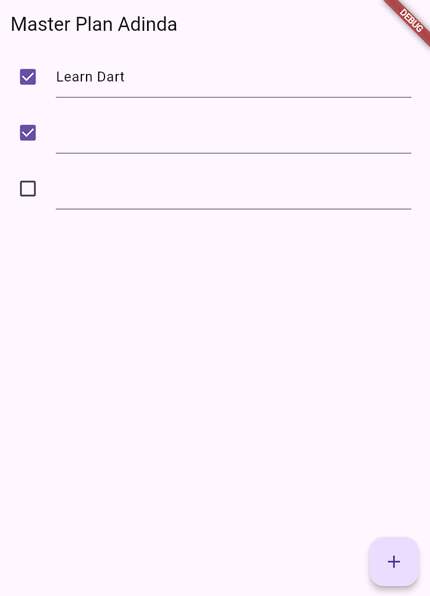
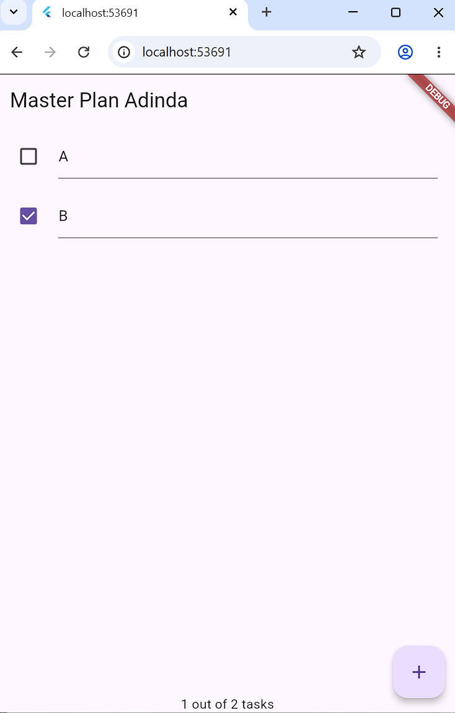

# TUGAS PRAKTIKUM 1

## 1. Jelaskan maksud dari langkah 4 pada praktikum tersebut! Mengapa dilakukan demikian?
Langkah 4 dilakukan dengan membuat file `data_layer.dart` yang berisi export dari `plan.dart` dan `task.dart`. Tujuannya agar proses import model di file lain menjadi lebih praktis karena cukup menggunakan satu baris import saja, yaitu `import '../models/data_layer.dart'`.

Cara ini membuat struktur kode lebih rapi dan memudahkan pengelolaan project, terutama jika jumlah model dalam aplikasi semakin banyak. Penambahan model baru cukup dilakukan dengan menambahkan export pada file tersebut tanpa perlu mengubah banyak import di file lain.

---

## 2. Mengapa perlu variabel plan di langkah 6 pada praktikum tersebut? Mengapa dibuat konstanta?
Variabel `plan` digunakan sebagai sumber data utama yang menyimpan seluruh data task pada aplikasi. Semua task yang ditampilkan pada layar berasal dari objek `plan` tersebut. Saat terjadi perubahan, seperti menambah task, mencentang checkbox, atau mengubah teks, data pada `plan` akan diperbarui melalui `setState()` sehingga tampilan dapat berubah secara otomatis.

Objek dibuat menggunakan `const Plan()` karena kondisi awal plan masih kosong dan nilainya tetap saat proses compile time. Penggunaan `const` membantu Flutter mengoptimalkan penggunaan memori karena objek tidak perlu dibuat ulang setiap kali widget mengalami rebuild.

---

## 3. Capture hasil dari Langkah 9 berupa GIF, kemudian jelaskan apa yang telah dibuat!

  

Pada langkah 9 telah dibuat method `_buildTaskTile()`. Method ini digunakan untuk menampilkan setiap task dalam bentuk `ListTile` yang terdiri dari `Checkbox` di bagian kiri dan `TextFormField` di bagian tengah.

Checkbox berfungsi untuk menandai status task selesai atau belum selesai. Ketika checkbox dicentang, nilai `complete` pada task akan berubah dan tampilan langsung diperbarui melalui `setState()`.

Sementara itu, `TextFormField` digunakan untuk menulis atau mengubah deskripsi task secara langsung. Perubahan data dilakukan menggunakan pola immutable update, yaitu dengan membuat salinan list menggunakan `List.from()` kemudian mengganti item tertentu dengan objek `Task` yang baru.

---

## 4. Apa kegunaan method pada Langkah 11 dan 13 dalam lifecycle state?
Method `initState()` dipanggil satu kali ketika widget pertama kali dimasukkan ke dalam widget tree. Pada langkah 11, method ini digunakan untuk melakukan inisialisasi `ScrollController` sekaligus menambahkan listener. Listener tersebut berfungsi untuk menutup keyboard secara otomatis ketika pengguna melakukan scroll pada daftar task. Inisialisasi dilakukan di `initState()` agar controller sudah siap sebelum widget ditampilkan.

Method `dispose()` dipanggil ketika widget dihapus secara permanen dari widget tree. Pada langkah 13, method ini digunakan untuk memanggil `scrollController.dispose()` guna membersihkan resource yang digunakan oleh `ScrollController`. Jika tidak dilakukan, controller dapat tetap tersimpan di memori dan menyebabkan memory leak. Pemanggilan `super.dispose()` juga diperlukan agar proses pembersihan dari parent class tetap berjalan dengan baik.

---

# TUGAS PRAKTIKUM 2

## 1. Jelaskan mana yang dimaksud InheritedWidget pada langkah 1! Mengapa yang digunakan InheritedNotifier?
`InheritedWidget` merupakan fitur bawaan Flutter yang digunakan untuk membagikan data ke seluruh widget tree tanpa perlu mengirim data secara manual melalui constructor. Dengan mekanisme ini, widget yang berada di bawahnya dapat langsung mengakses data melalui `context`.

Pada langkah 1, yang berperan sebagai `InheritedWidget` adalah class `PlanProvider` karena class tersebut melakukan extend terhadap `InheritedNotifier`, yang merupakan turunan dari `InheritedWidget`.

`InheritedNotifier` dipilih karena sudah memiliki kemampuan untuk mendengarkan perubahan dari `ValueNotifier`. Ketika nilai `ValueNotifier<Plan>` berubah, seluruh widget yang bergantung pada data tersebut akan otomatis melakukan rebuild tanpa perlu menggunakan `setState()` secara manual. Jika menggunakan `InheritedWidget` biasa, mekanisme notifikasi perubahan data harus dibuat sendiri sehingga implementasinya menjadi lebih rumit.

---

## 2. Jelaskan maksud dari method di langkah 3 pada praktikum tersebut! Mengapa dilakukan demikian?
Pada langkah 3 ditambahkan dua getter pada class `Plan`, yaitu `completedCount` dan `completenessMessage`.

Getter `completedCount` digunakan untuk menghitung jumlah task yang telah selesai dengan cara memfilter list `tasks` menggunakan `.where()` lalu mengambil jumlah datanya menggunakan `.length`.

Getter `completenessMessage` digunakan untuk menghasilkan pesan berupa string berdasarkan hasil `completedCount`, misalnya `"1 out of 2 tasks"`, yang nantinya ditampilkan pada bagian footer aplikasi.

Kedua getter tersebut ditempatkan pada file `plan.dart` karena termasuk bagian dari logika bisnis aplikasi, bukan logika tampilan. Penerapan ini sesuai dengan prinsip separation of concerns, di mana model bertanggung jawab mengelola data dan proses perhitungannya, sedangkan UI hanya menampilkan hasilnya.

---

## 3. Capture hasil dari Langkah 9 berupa GIF, kemudian jelaskan apa yang telah dibuat!

  

Pada praktikum 2, aplikasi telah menggunakan `InheritedNotifier` sebagai state management. Hasil implementasinya ditunjukkan dengan adanya footer seperti `"1 out of 2 tasks"` pada bagian bawah layar yang dapat berubah secara otomatis ketika task ditambahkan atau checkbox dicentang.

Perubahan tampilan tersebut terjadi tanpa penggunaan `setState()`, melainkan melalui `ValueNotifier` yang dipantau oleh `ValueListenableBuilder`. Ketika tombol tambah ditekan atau status task diubah, nilai pada `planNotifier.value` akan diperbarui dan seluruh UI yang menggunakan data tersebut akan otomatis ikut berubah.
